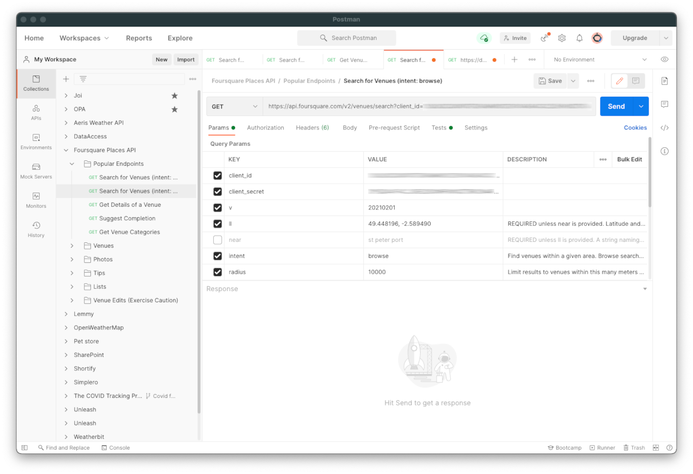

## Use UrlSearchParams to ensure your code is readable

With JavaScript's [UrlSearchParams](https://developer.mozilla.org/en-US/docs/Web/API/URLSearchParams) function, you can compose API calls that would be recognisable as a set of [Postman](https://www.postman.com/) key/value parameters. For example:

### In Postman

### In JavaScript 


const query = new URLSearchParams({
    client_id: "SOMETHINGNOTVERYSECRET",
    client_secret: "ASECRETTHING",
    v: "20210201", // All Foursquare API calls need a version. See https://developer.foursquare.com/docs/places-api/versioning/
    ll: position.coords.latitude + "," + position.coords.longitude, // User's latitude and longitude
    intent: "browse", // Find all venues with the defined 'radius' of 'll'
    radius: "10000", // Distance from starting point to search (metres)
    limit: "10", // Maximum number of values to return (up to 50)
    categoryId: "4d4b7105d754a06374d81259" // Search the 'Food' category. See the list of categories at https://developer.foursquare.com/docs/build-with-foursquare/categories/
  });
  fetch(API_URL + ENDPOINT + query, getOptions);


### Something similar in an SDK (Google Places Library)

Often, a system's [SDK](https://en.wikipedia.org/wiki/Software_development_kit)/API library is not as intuitive or broadly understood as a standard like [Open API](https://en.wikipedia.org/wiki/Open_API). With SDKs, you rely a little more on the developer documentation being easy to follow and consistently constructed.


// Find a food venue
function findRestaurant(location, name) {
  let restaurant_location = new Object ();
  restaurant_location.lat = location.lat;
  restaurant_location.lng =location.lng;
  var request = {
    location: restaurant_location,
    radius: '500',
    name: name
    };
  // Add food venue marker to Google map
  service = new google.maps.places.PlacesService(map);
  service.nearbySearch(request, addMarker);
}


## SDK versus REST API

The advantages of using a system's provided SDK instead of a REST API (whether that be Open API, a Postman collection, or some other standard) are that it will:

- Have no deployment issues (such as CORS)
- Be faster
- Be more conservative with its use of resources
- Have more commands
- Be free of any constraints imposed by a standard API specification.

However, if there is no SDK for your preferred development platform, a REST API may be your only option. For REST APIs, there's also a significant advantage in the degree of clarity that comes from a standardised approach.
 
## The two APIs combined: "Popular places for food in your area (from Foursquare, on a Google map)"
